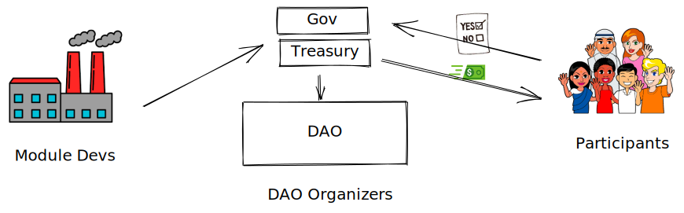

# Welcome to Fractal

Fractal is a an open DAO framework that unleashes a new wave of efficient, composable and secure DAOs that get stuff done without compromising asset protections! It does this by forming on-chain asset decision makers into subDAO hierarchies. These subDAO contributor groups are each empowered with their own Safe Treasury, governance (multi-signature or token vote) and permissions. This means each subDAO can operate like its own autonomous DAO, scale with it’s own tools and integrations… but never lose on-chain accountability to parent stakeholders.

Fractal offers value to everyone from DAO members to Web3 developers:

* DAO Organizers - Create your own on-chain DAOs, establish their structure and governance and track outcomes to keep them accountabile (note - soon switching will be even easier with an upcoming 'import your existing Safe Treasuries' feature).
* DAO Participants - Interact with the DAO based on subDAO permissions as well as track proposals, activities and asset movements.
* DeFi protocols - Use DAOs to support sophisticated workflows and scale up your DeFi protocol.

The components of the Fractal framework support the creation of a composable operating system for DAOs, which allows DAOs to outscale and outperform traditional organizations.

This site includes the following documentation:

* **User Guides** - Information about [using the Fractal app](broken-reference) to deploy, manage, and participate in DAOs.
* **FAQ** - Short answers to common [questions](user-guides/faq.md) about Fractal.

## Why Fractal?

Fractal fills the need for better DAO tooling and social coordination across the Web3 space. Existing DAO platforms limit the functionality and structure of DAOs by making assumptions about the functions of DAOs. Fractal expands the possibilities for DAOs by providing a composable and extensible framework that supports any structure and governance model that an organization could require.

### Benefits

The Fractal framework has several benefits over traditional DAO implementations:

* Build - A composable framework for organizations (a _Fractal_) to be formed as a group of independent governing bodies (_subDAOs) in any structure
* Govern - Custom governance for each subDAO with custom on-chain parent safeguards such as Freezing the subDAO in case of emergency.
* Scale - An expanding, “plug-and-play” feature set that allows your DAO (or specific subDAOs) to extend the capabilities including treasury management and governance.

## Nomenclature

##### A Fractal
A specific type of DAO where contributors can be structured into unique Parent and subDAO hierarchies each with its own governance and Safe treasury (by Gnosis). What makes these hierarchies stand out as a Fractal DAO is that each parentDAO has certain on-chain checks and balances over the Sub-DAO that it formed.

##### subDAO
A Safe treasury that has been spawned by a parentDAO. This subDAO always has certain on-chain safe-guards and controls that the parentDAO has customized on creation. Otherwise, the subDAO has autonomy to use it's treasury to make on-chain asset decisions with it's own distinct governance method (e.g. Multi-sig vs. Token Vote). Any parentDAO also has the autonomy to additionally become a parentDAO (but not a rootDAO).

##### parentDAO 
A Safe treasury that has spawned a subDAO. On creation, the parentDAO can set the subDAO's governance method, send it funds and set certain on-chain safe-guards and controls to keep the parent in some sort of control (e.g. freeze powers, delaying timelock period per transaction etc)

##### rootDAO 
The initial parentDAO that started the on-chain hierarchies that form the Fractal. This is the only Safe treasury that has no safeguards, checks or balances within the Fractal.
