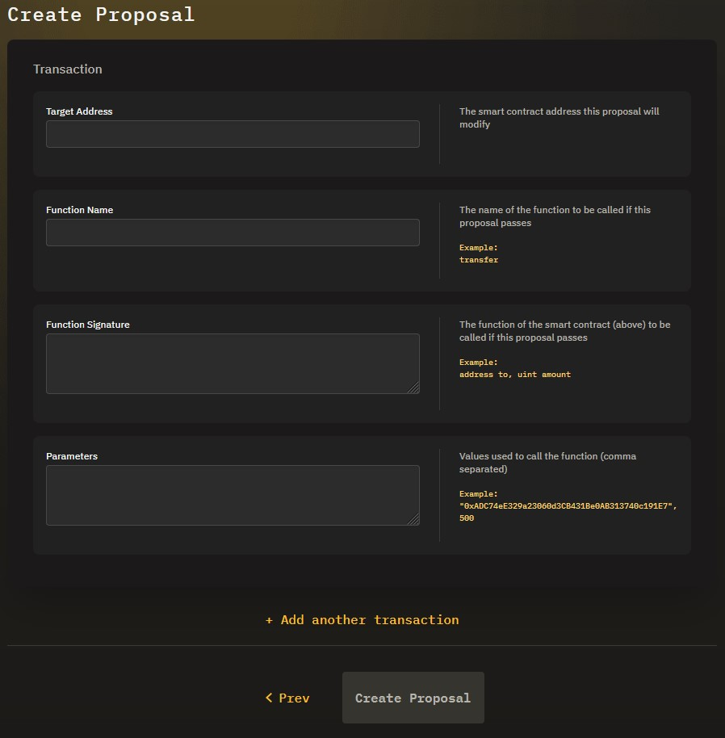
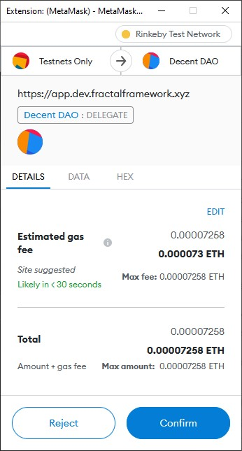

# Create a Proposal

## Overview

Proposals are a way to suggest that the Fractal DAO should do something. In the case of the Governance module, when executed, proposals initiate one or more transactions between the DAO and other addresses (contracts or wallets).

## Create a Proposal

Before creating a proposal, launch the Fractal web app, connect your wallet, and find the Fractal that you want to interact with.

On the Fractal dashboard, click **Create Proposal**. The Essentials screen opens:

Enter a description for the proposal. Other stakeholders in the Fractal will use the name to understand the purpose of the proposal. Click **Next: Add Transactions** to open the Transaction screen:

Enter the following information in the Transaction form:

* Target Address - The address of the contract or wallet the proposal will interact with
* Function Name - The name of the function at the target address the proposal will call
* Function Signature - A list of the parameters and how they are referenced by the target function, i.e., the way that the function is called
* Parameters - A comma-separated list of values for the parameters defined in the Function Signature field

If the proposal involves more than one transaction, click **Add Another Transaction** and enter the information defined in the list above.

Once you have entered all of the transaction information, click **Create Proposal**. Metamask opens and prompts you to confirm the transaction. The transaction covers the gas fees for creating the proposal:

Review the transaction and click **Confirm**. MetaMask closes and the Fractal app creates the Proposal. MetaMask pops up a Confirmed Transaction notification when the transaction is complete. Your proposal displays at the top of the Proposals list.

