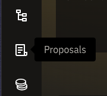
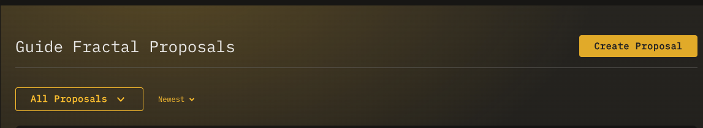
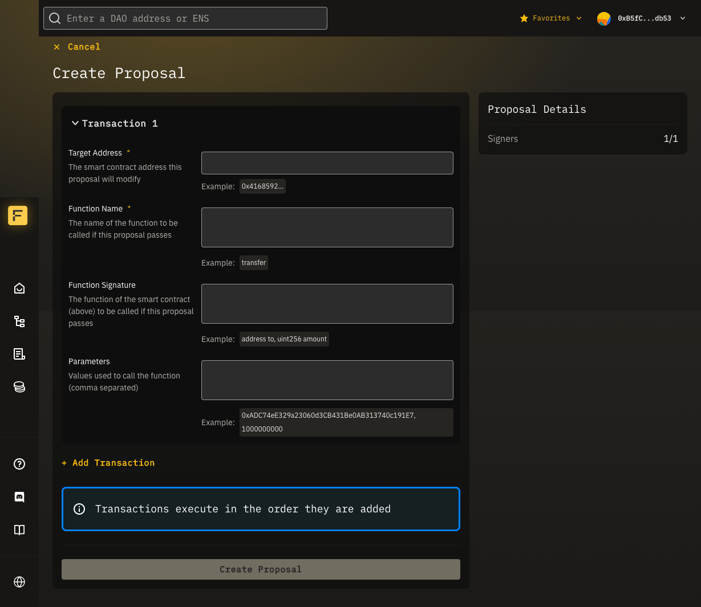

## Overview
A proposal is a way to suggest that a Fractal DAO initiates one or more transactions between the DAO and other addresses (contracts or wallets). 

A proposal is passed when the number of signers has reached the signer threshold.

A proposal must be passed in order for the proposal to be executed.

If the DAO where a proposal is submitted is a subDAO, then guards are put in place which allow the parentDAO to potentially block a proposal from being executed.

## Create a Proposal

First, visit a Multisig DAO you are a signer of.

In the left-hand menu, click the **proposals** icon.

Click "Create Proposal" in the upper right corner.

Enter the transactions that should be executed (if the proposal passes and is executed).


To enter multiple transactions, click **Add Transaction**.


Each transaction requires the following properties:
- **Target Address** - The smart contract address this proposal will modify
- **Function Name** - The name of the function to be called if this proposal passes
- **Function Signature** - The function of the smart contract (above) to be called if this proposal passes
- **Parameters** - Values used to call the function (comma separated)

When you have completed entering transactions, click "Create Proposal". You will be prompted to sign a TX in your wallet.


Transactions will be executed in the order they are entered.



When creating a proposal, your signature (a "yes" vote), will automatically be added to the proposal, so you do not need to sign the proposal after creation.


Once the transaction is confirmed, you can view the proposal details from the proposals dashboard.

