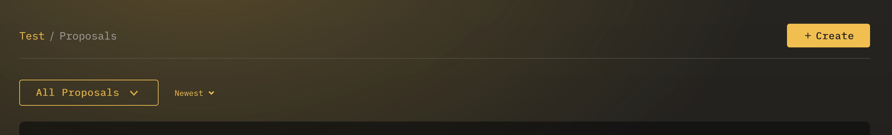
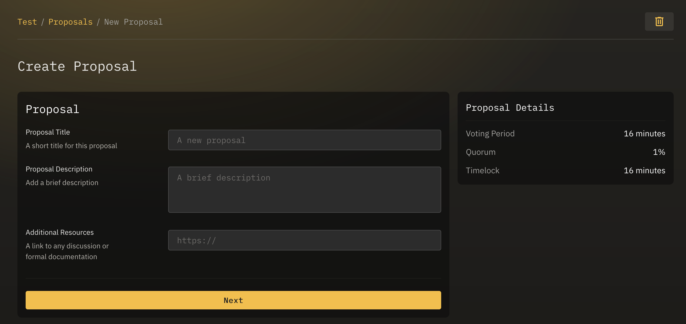
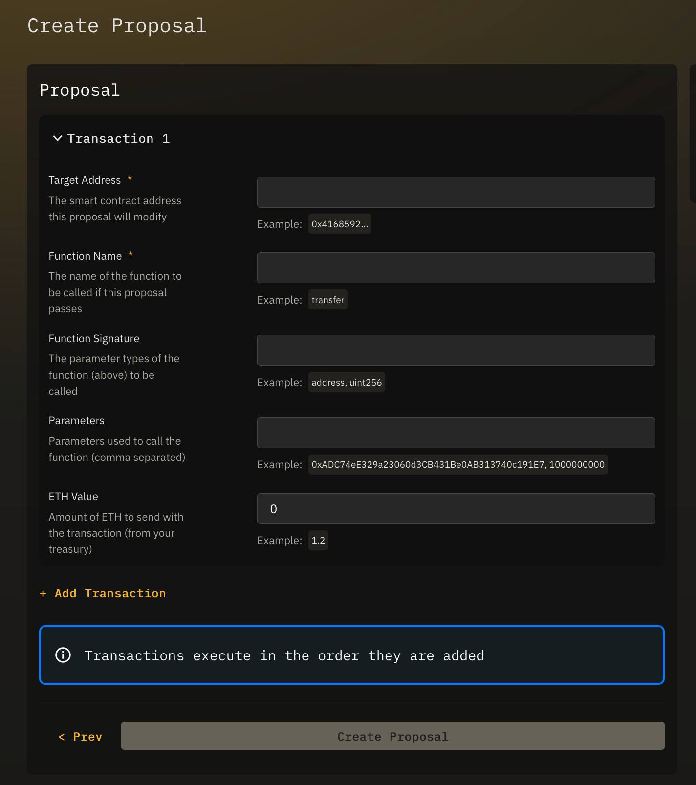

## Overview
A proposal is a way to suggest that a Safe executes one or more on-chain transactions. Proposals can integrate with any smart contract on the blockchain.

Whether the proposal is successful, and thus able to be executed, depends on the wishes of the Safe's tokens holders, or signers in the case of a multisig Safe.

---

## Create a Proposal

First, navigate to the Proposals page of the Safe you wish to submit a proposal to.

Here you will find the `Create` button, which takes you to the proposal creation flow.

### Proposal Metadata

The first step in creating a proposal is to give it an optional **title**, **description**, and **resource URL**.

These fields are optional, and will only be logged as Ethereum events, tagged to the proposal.  They are helpful for adding context to your proposal.


As multisig proposals are created and voted on off-chain, they do not contain this metadata step.


### Transaction Creator

Enter the transaction that will be executed if the proposal passes. To enter multiple transactions, click **Add Transaction**.

Each transaction requires the following properties:
- **Target Address** - The smart contract address this proposal will interact with.
- **Function Name** - The name of the smart contract function to be called if this proposal passes.
- **Function Signature** - The list of data type parameters for the smart contract function (comma separated).
- **Parameters** - The actual values used to call the function, as defined above with Function Signature (comma separated).

When you have completed entering transactions click `Create Proposal`.

You will be prompted to sign a transaction in your wallet plugin, and once confirmed you will be redirected to the Safe's Proposals page, where your new proposal will appear.

