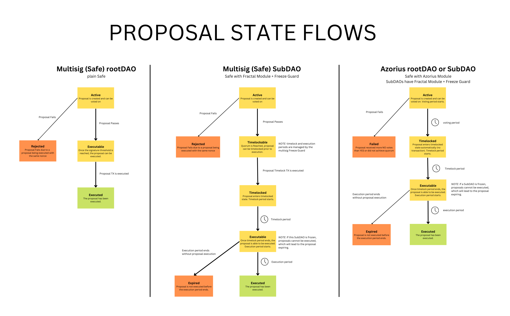

## Proposal States

**Active** - Proposal is created and can be voted on.  This is the initial state of all newly created proposals. Azorius / Multisig (all proposals).

**Timelocked** - A proposal that passes enters the `TIMELOCKED` state, during which it cannot yet be executed. This is to allow time for token holders to potentially exit their position, as well as the parent-Safe's time to initiate a freeze, if they choose to do so. A proposal stays timelocked for the duration of its `timelockPeriod`. All Azorius and multisig sub-Safes.

**Executable** - Following the `TIMELOCKED` state, a passed proposal becomes `EXECUTABLE`, and can then finally be executed on chain by anyone. Azorius / Multisig (all proposals).

**Executed** - The final state for a passed proposal.  The proposal has been executed on the blockchain. Azorius / Multisig (all proposals).

**Expired** - A passed proposal which is not executed before its `executionPeriod` has elapsed will be `EXPIRED`, and can no longer be executed. Azorius (all) / multisig sub-Safe.

**Failed** - A failed proposal. For a basic strategy (Token Voting), this would mean it received more `NO` votes than `YES` or did not achieve quorum. Azorius only.

**Rejected** - Proposal fails due to a proposal being executed with the same nonce. A multisig proposal is off-chain, and is signed with a specific nonce. If a proposal with the same nonce is executed, any proposal with the same nonce will be impossible to execute, reguardless of how many signers it has. Multisig only.

**Timelockable** - Quorum (or signers) is reached, the proposal can be 'timelocked' for execution. Anyone can move the state from Timelockable to TimeLocked via a transaction. Multisig sub-Safe only, Azorius (ERC-20 / NFT) Safes move from `ACTIVE` to `TIMELOCKED` automatically.