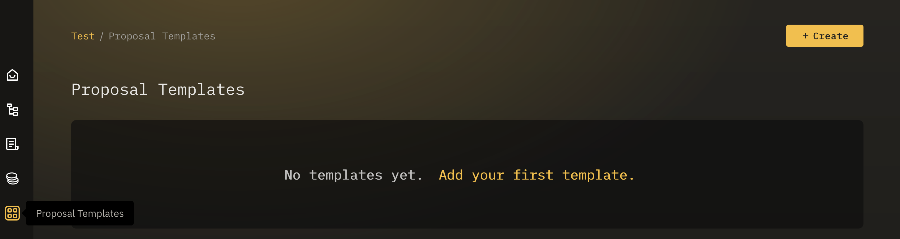
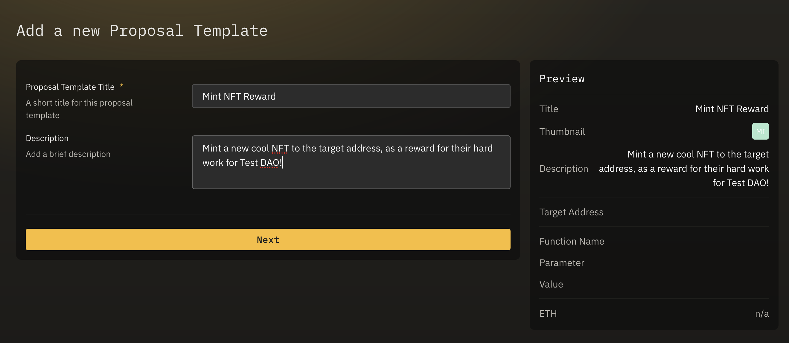
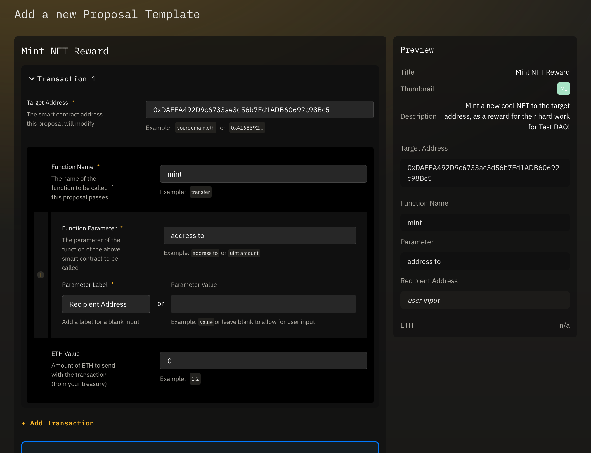
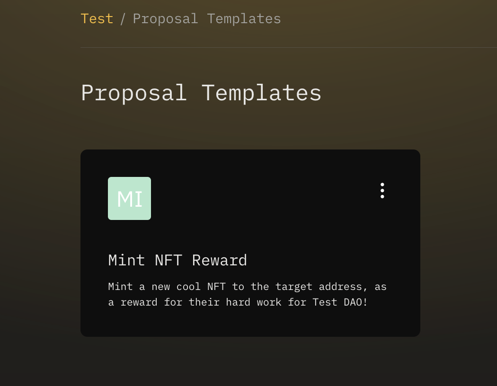
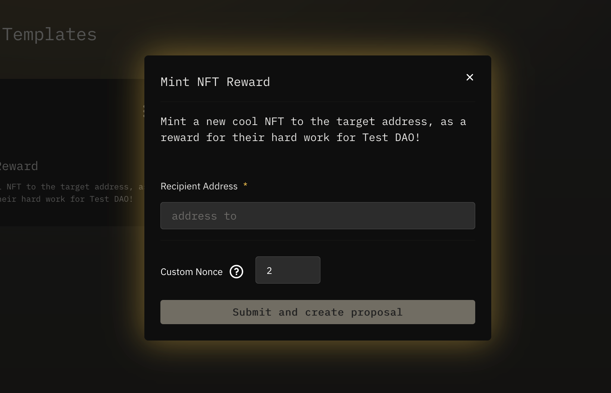

## Overview

Proposal templates allow for adding custom UI within your Safe for repeatable proposals.  The allows for structuring common tasks as embedded UI, reducing mistakes while leveraging the power of any other smart contracts on the blockchain.

---

## Creating a Proposal Template

### Templates List

The list of your Safe's templates appears as an option on the lefthand menu of Fractal.  From here you will also find a `Create` button, to enter the Proposal Template creation flow.

### Template Metadata

The first step in creating a template is adding a **title** and **description** to the template.  These fields will appear in the resulting Proposal Template, so they should make clear what the underlying transactions are looking to accomplish.

An updating preview of the resulting template data appears on the right of the screen throughout.

### Template Transactions

The next step in Template creation is very similar to [proposal creation](../proposals/create.md).

Here you will enter the **function name**, and each **function parameter** for the transaction you would like to turn into a template.

For each **function parameter** you will also enter *either* the value you would like *or* a string label, which will appear as an input field in the resulting template.  This will allow template users to add dynamic values into new proposals created using this template.

As in proposal creation, multiple transactions can be bundled into the same template, by clicking `Add Transaction `.

Once you are finished setting up your Proposal Template, click `Create Proposal` to initiate the transaction to propose creating this template.

### Using Your Template

After your proposal to create the template passes, you will now see the resulting template in the proposals list:

Clicking the Template opens its custom UI, which will create a new Safe proposal:


Even multisig governed Safes can add Proposal Templates.
