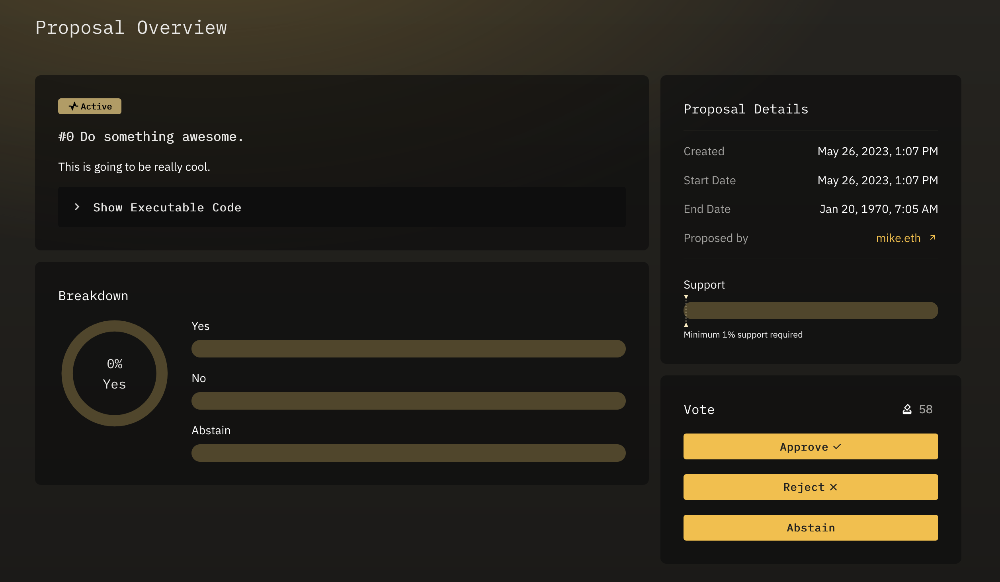

## Overview

Voting on an active proposal allows token holders (or signers) to signal their support or opposition.

---

## Submitting Your Vote

Ensure that you have [delegated](../proposals/delegate.md) your voting tokens, and navigate to the Proposal Details page of the proposal you would like to vote on.

Here you will see your voting options:

- **Approve** - Vote Yes on the proposal
- **Reject** - Vote No on the proposal
- **Abstain** - Vote neither yes or no, but signal that you have in fact voted. Your vote will also contribute to acheiving quorum.


Multisig voters can only sign the transaction, indicating a **yes** vote on the proposal.
