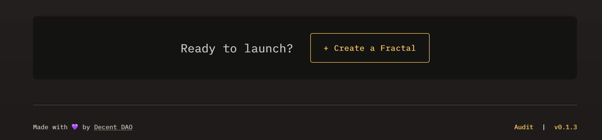
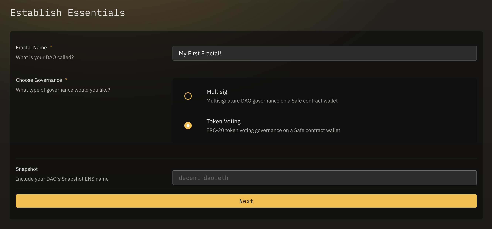
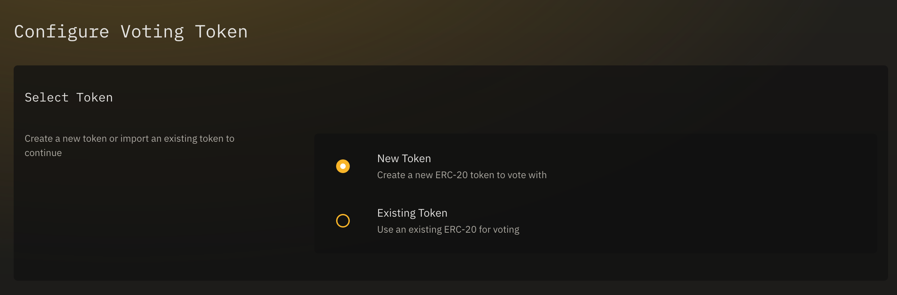
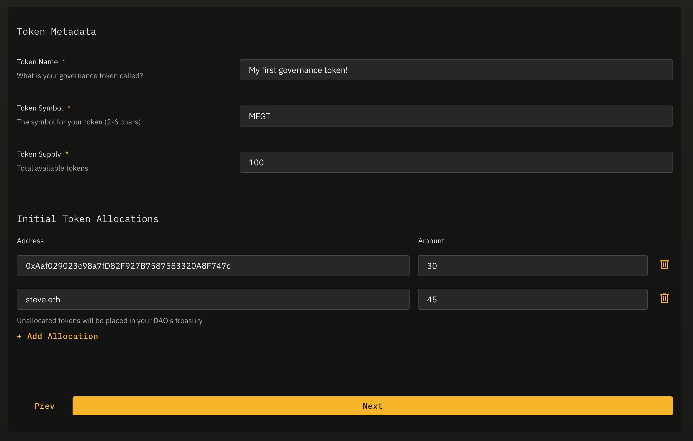
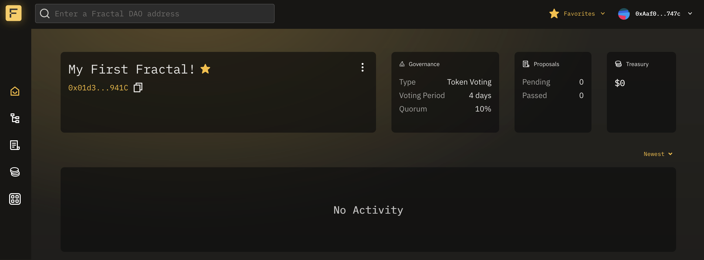
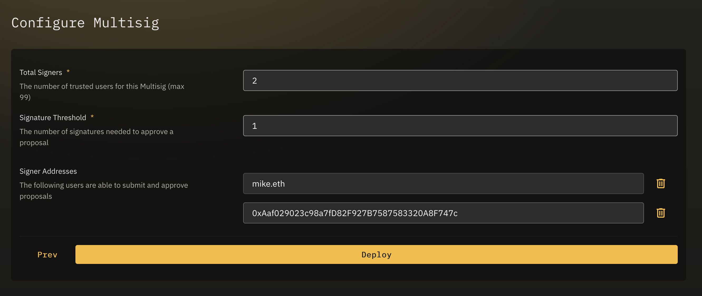

## Overview

Creating a Fractal **parent-Safe** deploys a new Safe{Wallet} contract, with an attached governance module.

As this is the top level *root* of a potential DAO hierarchy, no proposal is necessary, and the DAO will be deployed immediately by your connected wallet.

---

## Create a Fractal

From the Fractal app homepage, click `Create a Fractal`, or navigate to [https://app.fractalframework.xyz/create](https://app.fractalframework.xyz/create).

### Establish Essentials

The first step is to select a few initial options for your DAO, including:

- **Name** - what you'll call this DAO. This name is simply logged as a smart contract event, and can be changed later on via a proposal on your DAO.
- **Governance type** - How your DAO will be governed. A multisig DAO is simply a Safe{Wallet}.  For Token Voting or NFT (coming soon) governance, this is a Safe contract wallet with an [Azorius Zodiac module](https://github.com/decent-dao/fractal-contracts) attached.
- **Snapshot** - an optional ENS name used for your DAO's [Snapshot space](https://docs.snapshot.org/user-guides/spaces/create). This may be updated later on as well.

We'll enter a name and just select `Token Voting`.

### Configure Voting Token

Here we'll select the options for your governance token.

You may opt to create a new ERC-20 token, or use any existing ERC-20 token to vote on proposals for your new DAO.

We'll select `New Token`.

Your new governance token has a few parameters, which include:

- **Token Name** - The name of your new ERC-20 token.
- **Token Symbol** - A short "ticker" style symbol for your token, typically 3-5 characters.
- **Token Supply** - The total available supply of your token, as a *whole* number (think `ETH`, not `WEI`).
- **Initial Token Allocations** - Which addresses will receive tokens as soon as this token is deployed.  Unallocated tokens are deposited in your new DAO's treasury.


If `Existing Token` is selected, you will not be able to modify name, symbol, or supply, as these are already set on the existing ERC-20 token.


We'll set the shown params, and click `Next` to go to the final stage of DAO creation.

### Compose Governance

Lastly, we'll set governance parameters for our new DAO:

- **Voting Period** - The total time a new proposal is able to be voted on.
- **Quorum** - The percentage of tokens that are necessary to vote in order to make the pass a proposal, reguardless of how they vote.
- **Timelock Period** - The amount of time between when a proposal passes, and when it can actually be executed on the blockchain.  This can be as low as 0 minutes.
- **Execution Period** - The amount of time a passed proposal has to be executed before it expires.


These parameters are only estimates, and are ultimately converted to blocks when submitted to the governance contract.


You can now deploy your new Token Voting Fractal parent-Safe.  Connect to your wallet plugin and click `Deploy` to trigger a new transaction.

Once deployed successfully on the blockchain, you will be redirected to your new DAO's homepage. Note that your DAO's Safe{Wallet} address appears in the Fractal URL of your browser.

---

## Multisig parent-Safe

Deploying a multisig parent-Safe is much simpler, and involves only configuring the total number of signers, and the signer threshold to approve of a proposed transaction:

This is essentially just a Safe{Wallet} multisig with an associated Fractal name and optional Spapshot space.