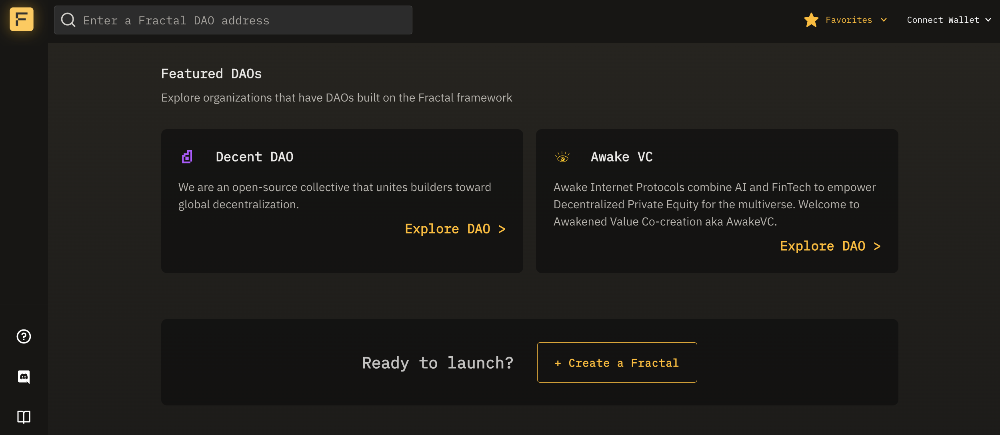

# View Fractal

The Fractal app is available at [app.fractalframework.xyz](https://app.fractalframework.xyz).

Fractal is built on Ethereum Virtual Machine (EVM) networks, including the testnet Goerli and Ethereum Mainnet.

There is no need to connect an Ethereum account to view a Safe, its proposals, treasury on Fractal, however for the full experience of voting, creating templates, and managing your Safe's governance, you will need an Ethereum wallet.

The most common browser-based web3 wallet is MetaMask, which you can [learn more about here](https://learn.metamask.io/lessons/what-is-a-crypto-wallet).

# Find a specific Safe

Use the search bar in the upper left of the app to search for specific Safes.

Enter the Ethereum address of the Safe that you would like to interact with. If the Safe exists, it will appear as a result.


You may search for and view any existing Safe{Wallet}, not just those created on Fractal.


## Explore 'Featured Organizations' built on Fractal

Open the Fractal App homepage and go to the 'Featured Organizations' section. Click on 'Explore' to check out a specific sub-Safe hierarchy created by our featured users from within Fractal. This includes Fractal's parent, [Decent DAO](https://www.decent-dao.org/) where our team sits as a sub-Safe.

# Connect Wallet

Click the `Connect Wallet` dropdown menu in the upper right corner of the app and again click `Connect`.

Select your installed wallet plugin from the available options to connect your wallet with Fractal.  Once connected, you should see your wallet address or ENS name and avatar in the upper right corner of the app.

Now that you are connected, Fractal will display your full range of options for any given Safe that you are a signer or token holder for.
