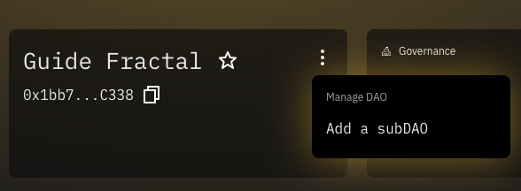
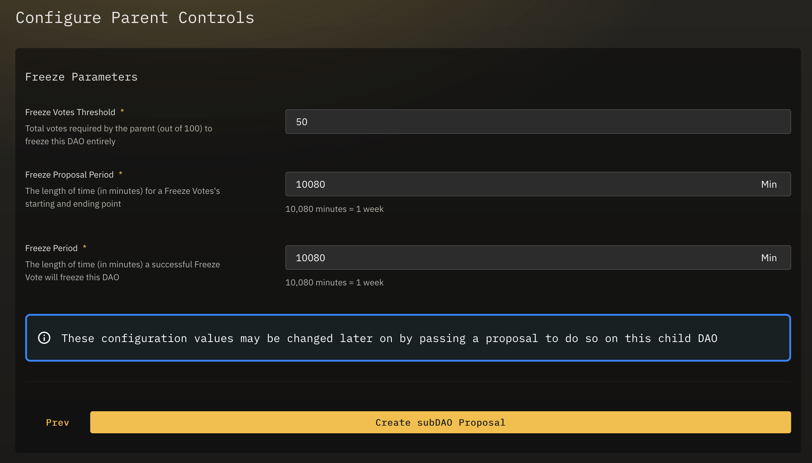
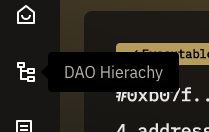

## Overview

Creating a Fractal **subDAO** deploys a new Safe{WALLET} contract, with an attached governance module.

At the end of the subDAO creation flow a proposal is submitted to the parentDAO, which must be passed by the parent in order to successfully deploy the DAO.

---

## Propose a subDAO

Visit the homepage of the DAO you would like to create a subDAO for (this DAO will be the parent).


For multisig DAOs, you must be a signer to propose a subDAO.


Using the `Manage DAO` menu, select **Add a subDAO**.

### New DAO creation

Follow the same [DAO creation flow](../rootdaos/create.md) as for rootDAOs.

### Configure Parent Controls

Here you will configure the parentDAO control parameters for your subDAO:

- **Freeze Votes Threshold** - Total votes required by the parent to *freeze* the subDAO.
- **Freeze Proposal Period** - The length of time for a freeze vote on the subDAO.
- **Freeze Period** - The length of time a successful Freeze Vote will freeze this DAO from executing proposals.

### Create subDAO Proposal

Click `Create subDAO Proposal` to create a proposal on the parentDAO to deploy this subDAO.

Passing this proposal will allow the subDAO deployment transaction to be executed.

### Viewing your subDAO

After passing and executing your subDAO proposal, your DAO is now ready to interact with.

Visit the **DAO Heirarchy** page from the left menu of your parentDAO to see all subDAOs.

---

## Multisig subDAO

In addition to [DAO creation flow](../rootdaos/create.md#multisig-rootdao) for multisig DAOs, a multisig subDAO will have the following additional parameters:

- **Timelock Period** - The amount of time between when a proposal passes, and when it can actually be executed on the blockchain.
- **Execution Period** - The amount of time a passed proposal has to be executed before it expires.