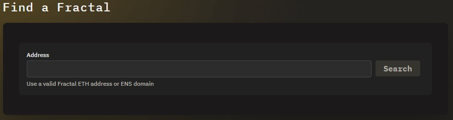

# Find a Fractal

## Overview

Use the Find a Fractal function to open the Fractal dashboard for a DAO that you want to interact with.

## Find a Fractal

Before you get started, open the Fractal web app and connect your wallet. Click **Find a Fractal**. The Find a Fractal screen opens:

Enter the address of the Fractal DAO that you want to interact with. The Proposals screen of the DAO dashboard opens. If the DAO has any associated proposals, they will be displayed:

