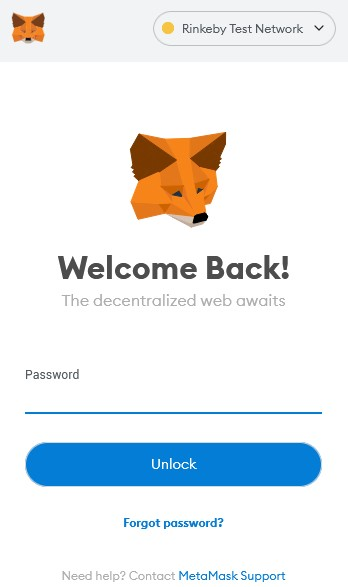
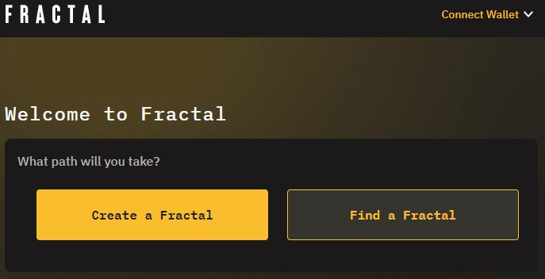
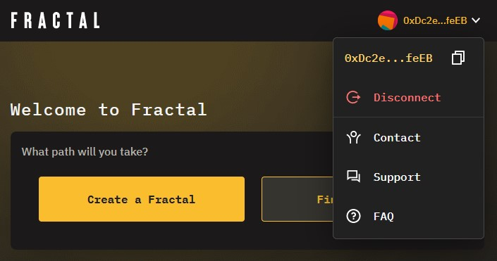

# Connect Your Wallet

You can connect your wallet using any browser integration or Wallet Connect. The steps below show how to connect your MetaMask wallet:

### Log in to Your Wallet

If you are using MetaMask, click the browser extension icon and enter your password:

### Open the Fractal App

Go to [app.fractalframework.xyz](https://app.fractalframework.xyz) or [app.dev.fractalframework.xyz](https://app.dev.fractalframework.xyz). The web app landing screen displays:

### Connect Wallet

Click the Connect Wallet dropdown menu in the upper right corner and select **Connect Wallet**:

The app displays your options. If you are logged in to a wallet with a browser plugin, it shows up in the list, as shown below:

To connect to a browser-based wallet, select it from the list. If you have not connected your wallet before, the wallet extension may open a window and prompt you to select which wallet you want to connect:

Select the correct wallet and click **Next**. The Fractal app connects to your wallet and displays your wallet address (or ENS name) in the upper right corner of the page, as shown below:

You can now use the wallet to pay gas fees for transactions with Fractal DAOs.
