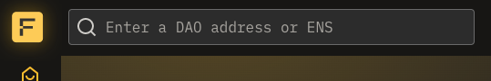

# Find a Fractal

## Overview

Use the Find a Fractal function to open the Fractal dashboard for a DAO that you want to interact with.

## Find a Fractal

Before you get started, open the Fractal web app and connect your wallet. In the upper left, you will see a search box. Click inside the input.

Enter the address of the Fractal DAO that you want to interact with. If the DAO exists, it will appear in the list. Clicking **View DAO** will open the Proposals screen of the DAO dashboard. If the DAO has any associated proposals, they will be displayed:.

