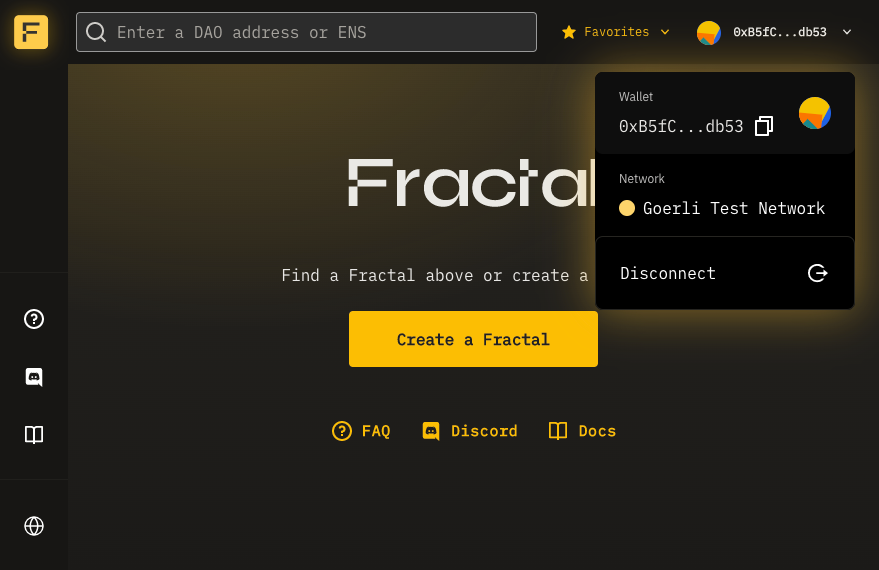

# Open the Fractal App

Go to [app.fractalframework.xyz](https://app.fractalframework.xyz). The web app landing screen displays:

# Connect Your Wallet

Once you've had time to explore, you can connect your wallet using any browser integration or Wallet Connect. The steps below show how to connect your MetaMask wallet:

### Log in to Your Wallet

If you are using MetaMask, click the browser extension icon and enter your password:

### Connect Wallet

Click the `Connect your Wallet` button, or in dropdown menu in the upper right corner and select **Connect Wallet** abd click **Connect**:

The app displays your options. If you are logged in to a wallet with a browser plugin, it shows up in the list, as shown below:

To connect to a browser-based wallet, select it from the list. If you have not connected your wallet before, the wallet extension may open a window and prompt you to select which wallet you want to connect:

Select the correct wallet and click **Next**. The Fractal app connects to your wallet and displays your wallet address (or ENS name) in the upper right corner of the page, as shown below:

You can now use the wallet to pay gas fees for transactions with Fractal DAOs.
