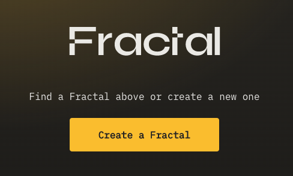
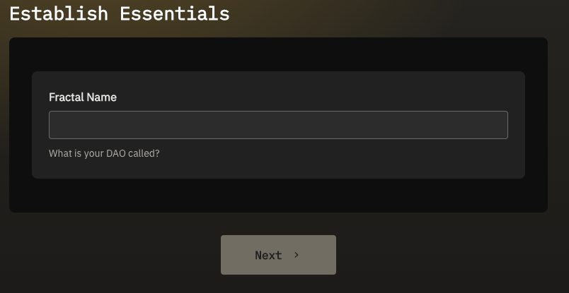
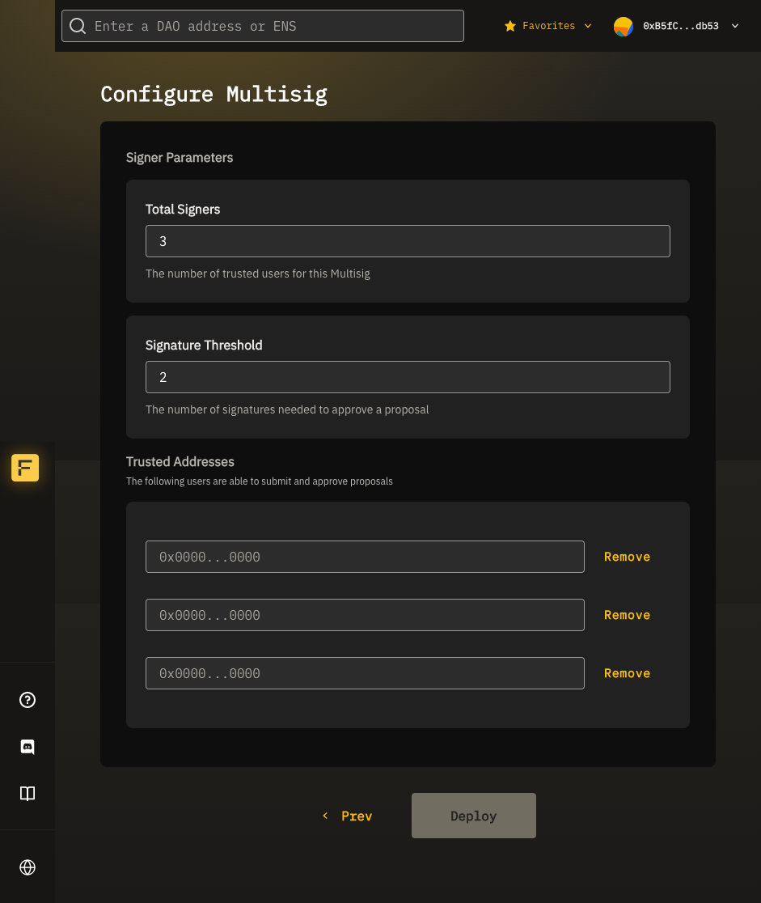
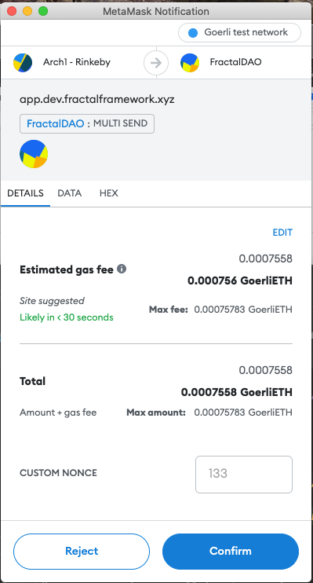

# Creating a Fractal Multisig rootDAO

## Overview

This guide shows how to create a **rootDAO**. If you would like to create a subDAO, please visit: [Create a subDAO](create-a-sub-dao.md)

Creating a Fractal adds a smart contract for a basic DAO at a new address on the blockchain. You can create new Fractals on any supported Ethereum testnet or mainnet. All you need is an ERC20 wallet and some ETH to cover the gas fees.

## Create a Fractal

Before you get started, open the Fractal app and connect to your wallet:

[Getting Started](../../getting-started.md)

Click **Create a Fractal**.

Enter a name for your Fractal DAO and click **Next**. 

Select "Governance Type" as "Multisig" and click "Next".

The **Configure Multisig** screen lets you define the signers who can create and vote on proposals.

Set your signatories and signer threshold:
- **Total signers**: The number of signers that can submit and approve transactions. One address must be entered under "Signer Addresses" for each signer.
- **Threshold**: How many signers must sign a proposal for it to pass (and be executed).

In the example image below, a proposal for this DAO would have 3 total signers, and would require 2 of those signers to sign for the proposal to pass.

Once you have configured your governance model, click **Deploy**. 

The Fractal App opens your connected wallet so that you can approve the transaction:

The transaction amount covers the gas fees required to get the transaction mined on chain. Review the transaction and click **Confirm**. MetaMask sends the transaction and the Fractal contracts deploy your DAO. MetaMask displays a notification when the transaction is completed. 

The Fractal app opens the DAO dashboard for your new DAO.


Grab the address of your new Fractal from the URL in your browser's address bar.



Deploying a DAO creates and executes your first proposal with 4 transactions. This proposal will show up on your DAO dashboard.

