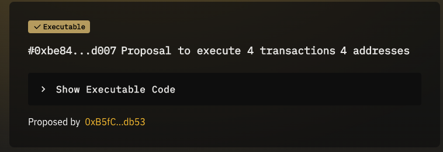
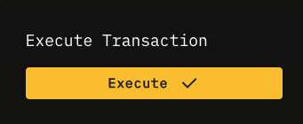
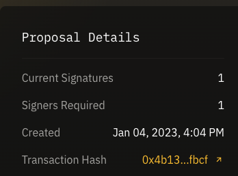
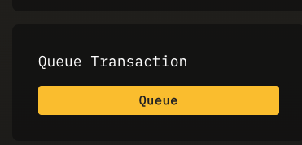

# Executing a Multisig Proposal

## Overview
If you are a signer on a Mulitsig DAO, you can execute a proposal which has been passed but has not yet been executed. Executing a proposal will execute all transactions in the proposal.

If the DAO is a SubDAO, there are some stipulations around if/when a proposal can be executed.

See [RootDAO proposal lifecycle](../proposal-lifecycle/root-dao-proposal-lifecycle.md) and [SubDAO proposal lifecycle](../proposal-lifecycle/sub-dao-proposal-lifecycle.md) for more information on the lifecycle of a proposal.

## Parent/RootDAO
**For DAOs that are *not* SubDAOs (have no parents)**, to execute a passed proposal:

1. Visit the proposal that you would like to execute. 
2. You can review the transactions that will be executed by clicking **Show Executable Code**.
  
3. Click the **Execute** button.
  

#####
Once the execution transaction is confirmed, the state of the proposal will show up as "Executed".

You can view the transaction by clicking on the link next to **Transaction Hash** in **Proposal Details**

## SubDAO
**For DAOs are SubDAOs**, to execute a passed proposal:

1. Queue the proposal by visiting the proposal and clicking the "Queue" button. You will be prompted to sign a transaction in your wallet.
 
2. Once the transaction confirms, the timelock period starts. This is the period of time (set by the ParentDAO) which must pass before the transaction can be executed. The **Execute** button will be disabled until the timelock period ends.
3. Once the timelock period ends, the execution period starts. During this period, the proposal can be executed by clicking the "Execute" button.
  


If a SubDAO proposal is not executed within the execution period, it will become expired.
When a proposal is expired, it cannot be executed.
