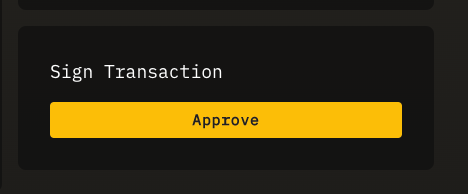

# Vote on a Multisig Proposal

## Overview
This will give an overview of how to vote on a Multisig proposal. 

To vote on the proposal, **you must be a signer on the DAO**.

For Mulitsig DAOs, you can only vote "yes" on a proposal, you cannot vote "no".

## Vote on a proposal

1. Visit a DAO you are the signer on.
2. Visit the proposal you want to approve.
3. Click "Approve" under "Sign Transaction". You will be prompted to sign a transaction with your wallet.
 
4. Once the transaction confirms, your vote will show on the a