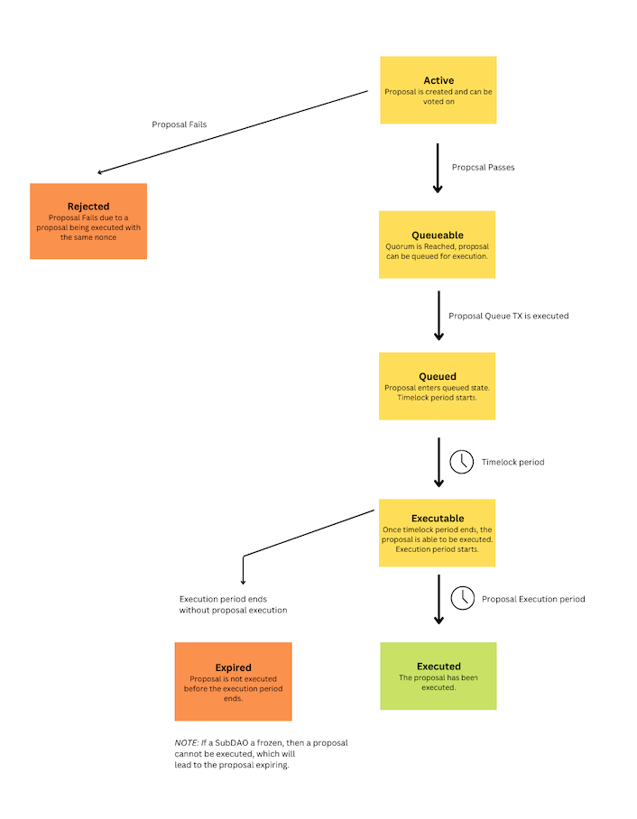

# RootDAO Proposal Lifecycle

## Overview
A proposal in a Multisig subDAO follows the lifecycle displayed in the diagram below.

The different phases are explained in a key underneath.

## Key

#### Active
As soon as the proposal has been created, it becomes active and any signer on the DAO can vote on the proposal. There is no voting period, and the proposal will be able to be voted on as long as the proposal is not passed or executed.

#### Queueable
Once the threshold number of signers have signed the proposal, the proposal is passed and becomes queueable.

#### Queued
Once the transaction has been queued. The timelock period starts when the transaction period is queued.

#### Timelock period
The timelock period is the time between when a transaction is queued and becomes executable. During this time, the proposal can't be executed.

The parentDAO is responsible for setting the timelock period.

#### Executable
Once the timelock period ends, a queued proposal becomes executable and the execution period starts.

A proposal that is executable can be executed, executing the transactions in the proposal.

#### Execution Period
After a transaction is executable, there is a limited amount of time when the transaction can be executed.

If a proposal is not executed in this time period, the proposal becomes expired. 

The parentDAO is responsible for setting the execution period.

#### Executed
After a proposal is executed, it enters the Executed state.

#### Rejected
If another proposal with the same nonce is executed, then a proposal with the same nonce which is not executed will enter a Rejected state. A rejected proposal can no longer be executed.

#### Frozen
If a subDAO is frozen by the parentDAO, it can't execute transactions.