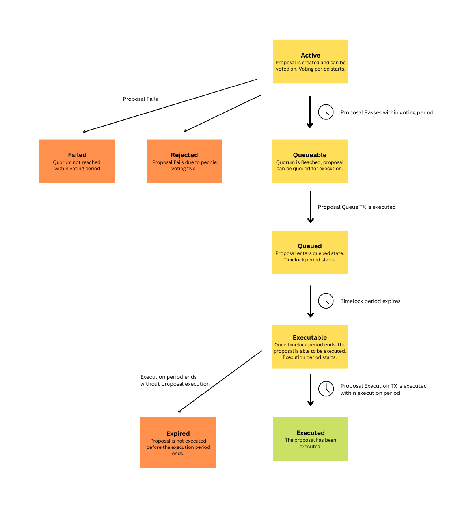

# rootDAO Proposal Lifecycle

## Overview

A proposal in a Token Voting rootDAO follows the lifecycle displayed in the diagram below.

The different phases are explained in a key underneath.

## Key

#### Active
As soon as the proposal has been created, the voting period starts, and any wallet that has DAO voting tokens allocated to it
can vote on the proposal. Once the voting period ends, votes can no longer be cast.

#### Queueable
Once the voting period ends, if the vote has passed, then the proposal can be queued. Queueing the proposal will prepare the proposal to have its transactions executed.
In order to queue a proposal, someone must sign a transaction (and pay the gas associated with the transaction).

#### Queued
Once a proposal has been queued, the timelock period begins.
The proposal cannot be executed until the timelock period ends.

#### Executable
Once the timelock period ends, the proposal becomes executable. A proposal that is executable can be executed, which will the transactions in the proposal.

A proposal is only executable during the execution period, which begins when the proposal is queued. 

#### Executed
After a proposal is executed, the transactions on the proposal are executed and the proposal enters the **Executed** state.

#### Expired
If the execution period expires before the proposal is executed, the proposal will enter the **Expired** state and will no longer be able to be executed.

#### Failed
The quorum is not reached within the voting period, the proposal enters the **Failed** state.

#### Rejected
If a quorum of voters vote **No** on a proposal within the voting period, then the proposal enters the **Rejected** state.